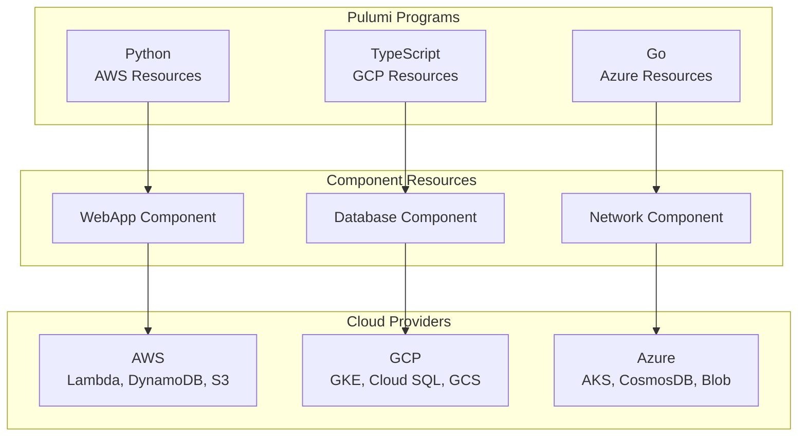

# 🚀 Pulumi Cloud Infrastructure

[](https://www.pulumi.com/)
[](https://aws.amazon.com/)
[](https://cloud.google.com/)
[](https://azure.microsoft.com/)
[](LICENSE)

Modern Infrastructure as Code using Pulumi with multiple programming languages. Build, deploy, and manage cloud infrastructure using Python, TypeScript, and Go.

## 🎯 Overview

This repository showcases production-ready Pulumi infrastructure across AWS, GCP, and Azure using familiar programming languages. Leverage the full power of general-purpose languages for infrastructure automation.

### ✨ Why Pulumi?

- **Real Programming Languages**: Python, TypeScript, Go, C#, Java
- **IDE Support**: IntelliSense, debugging, refactoring
- **Testing**: Unit tests with familiar testing frameworks
- **Packages**: Reuse code via npm, PyPI, Go modules
- **Policy as Code**: CrossGuard for compliance enforcement
- **State Management**: Automatic state handling with Pulumi Cloud or self-hosted

## 📦 Projects

### AWS (Python)

| Project | Description | Technology Stack |
|---------|-------------|------------------|
| [serverless-api](./aws-python/serverless-api) | Serverless REST API with Lambda, API Gateway, DynamoDB | Python, boto3 |
| [container-service](./aws-python/container-service) | ECS Fargate with ALB and auto-scaling | Python, Docker |
| [static-website](./aws-python/static-website) | S3 + CloudFront static site with CI/CD | Python, S3, CloudFront |

### GCP (TypeScript)

| Project | Description | Technology Stack |
|---------|-------------|------------------|
| [gke-microservices](./gcp-typescript/gke-microservices) | GKE cluster with Cloud SQL and Load Balancer | TypeScript, Kubernetes |
| [cloud-functions](./gcp-typescript/cloud-functions) | Cloud Functions with Pub/Sub triggers | TypeScript, Node.js |
| [data-pipeline](./gcp-typescript/data-pipeline) | BigQuery data pipeline with Cloud Storage | TypeScript, BigQuery |

### Azure (Go)

| Project | Description | Technology Stack |
|---------|-------------|------------------|
| [aks-cluster](./azure-go/aks-cluster) | AKS with Azure KeyVault and CosmosDB | Go, Kubernetes |
| [function-app](./azure-go/function-app) | Azure Functions with Event Grid | Go, Azure Functions |
| [web-app](./azure-go/web-app) | App Service with SQL Database | Go, .NET |

## 🏗️ Architecture Patterns

### Multi-Cloud Component Resources



## 🚀 Quick Start

### Prerequisites

- **Pulumi CLI**: [Install Pulumi](https://www.pulumi.com/docs/get-started/install/)
- **Cloud CLI**: AWS CLI, gcloud, or Azure CLI
- **Language Runtime**: Python 3.11+, Node 18+, or Go 1.21+
- **Pulumi Account**: Sign up at [app.pulumi.com](https://app.pulumi.com)

### Deploy AWS Serverless API (Python)

```bash
cd aws-python/serverless-api

# Install dependencies
pip install -r requirements.txt

# Login to Pulumi
pulumi login

# Create a new stack
pulumi stack init dev

# Configure AWS region
pulumi config set aws:region us-east-1

# Deploy
pulumi up

# Get outputs
pulumi stack output api_url
```

### Deploy GCP Microservices (TypeScript)

```bash
cd gcp-typescript/gke-microservices

# Install dependencies
npm install

# Login to Pulumi
pulumi login

# Create stack
pulumi stack init dev

# Configure GCP project
pulumi config set gcp:project my-project-id

# Deploy
pulumi up
```

### Deploy Azure AKS (Go)

```bash
cd azure-go/aks-cluster

# Initialize Go modules
go mod tidy

# Login to Pulumi
pulumi login

# Create stack
pulumi stack init dev

# Configure Azure location
pulumi config set azure-native:location eastus

# Deploy
pulumi up
```

## 🧪 Testing

Each project includes comprehensive tests:

### Python Tests
```bash
cd aws-python/serverless-api
pytest tests/
```

### TypeScript Tests
```bash
cd gcp-typescript/gke-microservices
npm test
```

### Go Tests
```bash
cd azure-go/aks-cluster
go test ./...
```

## 📊 Cost Estimation

Preview infrastructure costs before deployment:

```bash
# Requires Pulumi Business or Enterprise
pulumi preview --show-costs
```

## 🔒 Policy as Code

Enforce compliance with Pulumi CrossGuard:

```typescript
// policy/aws-security.ts
new PolicyPack("aws-security", {
    policies: [
        {
            name: "s3-no-public-read",
            description: "Prohibits public read access to S3 buckets",
            enforcementLevel: "mandatory",
            validateResource: validateResourceOfType(aws.s3.Bucket, (bucket, args, reportViolation) => {
                if (bucket.acl === "public-read" || bucket.acl === "public-read-write") {
                    reportViolation("S3 buckets cannot have public read access");
                }
            }),
        },
    ],
});
```

## 🔄 Stack References

Share resources across stacks:

```python
# Stack A: Create VPC
vpc = awsx.ec2.Vpc("my-vpc")
pulumi.export("vpc_id", vpc.vpc_id)

# Stack B: Reference VPC
vpc_stack = pulumi.StackReference("org/project/stack-a")
vpc_id = vpc_stack.get_output("vpc_id")
```

## 📚 Component Resources

Create reusable infrastructure components:

```python
class WebApplication(pulumi.ComponentResource):
    def __init__(self, name, args, opts=None):
        super().__init__('custom:app:WebApplication', name, {}, opts)
        
        # Create ALB
        self.alb = aws.lb.LoadBalancer(...)
        
        # Create ECS Service
        self.service = aws.ecs.Service(...)
        
        # Export outputs
        self.register_outputs({
            "url": self.alb.dns_name
        })
```

## 🤝 Contributing

Contributions welcome! See [CONTRIBUTING.md](CONTRIBUTING.md).

## 📄 License

MIT License - see [LICENSE](LICENSE)

## 🙏 Resources

- [Pulumi Documentation](https://www.pulumi.com/docs/)
- [Pulumi Examples](https://github.com/pulumi/examples)
- [Pulumi Registry](https://www.pulumi.com/registry/)
- [Pulumi Community Slack](https://slack.pulumi.com/)

---

**⭐ Star this repository if you find it useful!**
